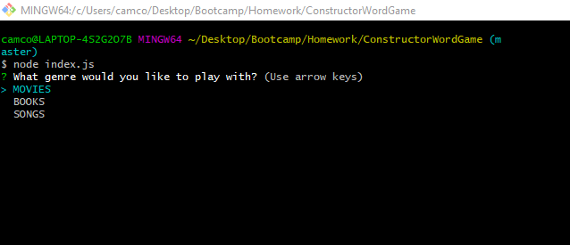
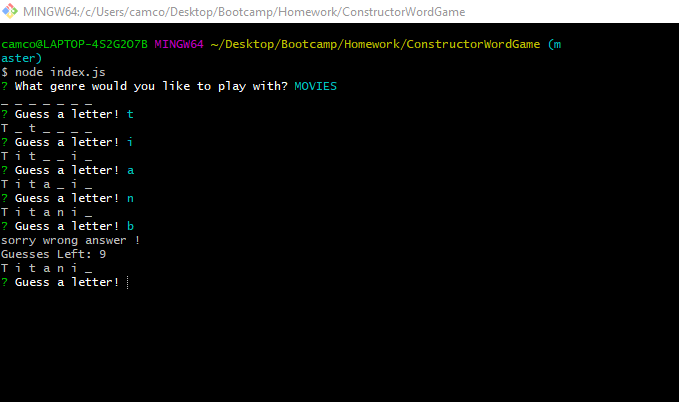
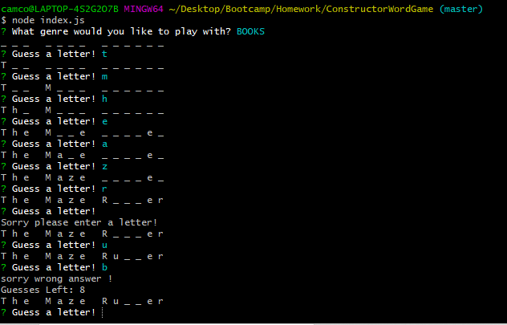
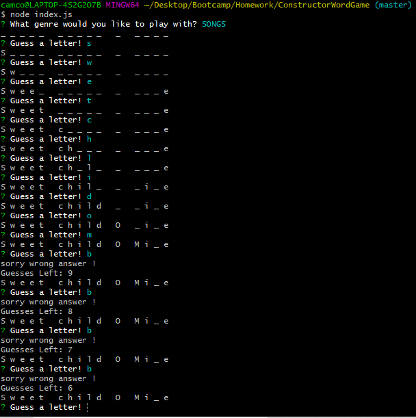

# Constructor Word Game
This is a command line node application game that lets the player choose their genre of pop-culture, it then randomly chooses a one of five popular works related to the chosen genre.

functions
 * The player is then given blanks for each letter
 * The player can only enter one letter at a time
    * If they get it right it replaces the corresponding letter 
    * If they get it wrong the game will count down the wrong attempts until you lose
 * The only way to lose is to guess wrong 10 times

 **Photos**

 * Choosing a genre: 

 

 * Movies genre in action: 

 

 * Books genre in action:

 

 * Songs genre in action:

 

 **NPM(s) required**
 * inquirer